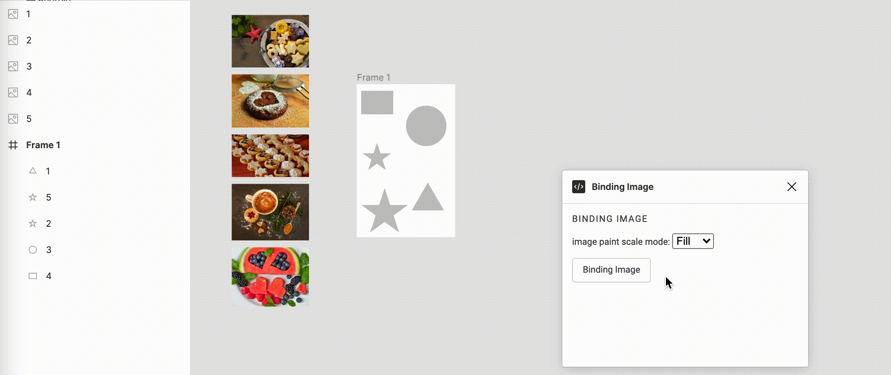

# Figma plugin - image binding

## 開啟終端機並於該資料夾底下進行安裝動作
    $ npm install -g typescript
    $ npm install
    $ cd binding-image
    $ tsc

## import至figma
 1.請先下載figma的桌面應用程式

 2.點擊plugins > Development > Import plugin from manifest...

 3.點選binding-image資料夾內的manifest.json

 ## 功能展示
 1.先放置想要binding的圖片

 2.名稱與Frame想要放置的位置一致
 
 3.開啟插件並選取圖片及Frame

 4.選擇圖片填滿模式
 
 5.點擊Binding Image的按鈕後會在Frame右邊顯示綁定好圖片的新Fram

 
